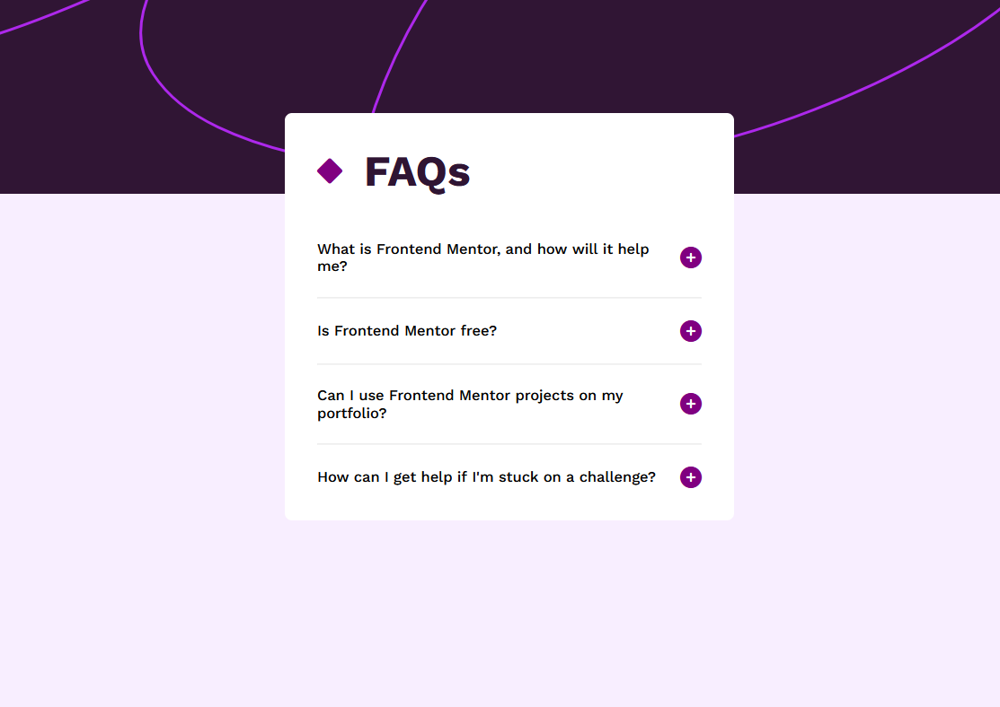

# Frontend Mentor - FAQ accordion solution

This is a solution to the [FAQ accordion challenge on Frontend Mentor](https://www.frontendmentor.io/challenges/faq-accordion-wyfFdeBwBz). Frontend Mentor challenges help you improve your coding skills by building realistic projects. 

## Table of contents

- [Overview](#overview)
  - [The challenge](#the-challenge)
  - [Screenshot](#screenshot)
  - [Links](#links)
- [My process](#my-process)
  - [Built with](#built-with)
  - [What I learned](#what-i-learned)
  - [Continued development](#continued-development)
- [Author](#author)

## Overview

### The challenge

Users should be able to:

- Hide/Show the answer to a question when the question is clicked
- Navigate the questions and hide/show answers using keyboard navigation alone
- View the optimal layout for the interface depending on their device's screen size
- See hover and focus states for all interactive elements on the page

### Screenshot

### Links

- Solution URL: [Add solution URL here](https://github.com/jambanix/frontendmentor_faq-accordion)
- Live Site URL: [Add live site URL here](https://jambanix.github.io/frontendmentor_faq-accordion/)

## My process

### Built with

- HTML5
- CSS
- Flexbox
- CSS Grid
- Mobile-first workflow
- Javascript

### What I learned

This was my first time using Javascript. I learned how to make an accordion and what tabindex is, and how to cycle through it using the arrow keys.

### Continued development

I would like to make a more "flashy" accordion by having it transition in instead of appearing instantly.

## Author

- Frontend Mentor - [@jambanix](https://www.frontendmentor.io/profile/jambanix)
